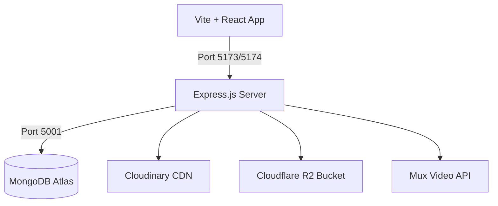

# 🎓 Educator LMS - Full Architecture & System Documentation

Welcome to the **Educator LMS** system documentation. This document provides a comprehensive overview of the system architecture, directory structures, data models, API endpoints, cloud configurations, and troubleshooting steps.

---

## 📁 Table of Contents
1. [System Architecture Overview](#1-system-architecture-overview)
2. [Technology Stack](#2-technology-stack)
3. [Codebase Directory Structure](#3-codebase-directory-structure)
4. [Database Schemas & Models](#4-database-schemas--models)
5. [REST API Endpoint Reference](#5-rest-api-endpoint-reference)
6. [Cloud Integrations Setup](#6-cloud-integrations-setup)
7. [Local Setup & Seeding](#7-local-setup--seeding)
8. [Troubleshooting Guide](#8-troubleshooting-guide)

---

## 1. System Architecture Overview

Educator LMS is built on a modern **MERN (MongoDB, Express, React, Node)** architecture, split into two decoupled layers:



### Flow of Access Gating
1. **Unregistered/Guest:** Accesses the Landing and Registration pages.
2. **Students:** Registers -> Accesses dashboard -> Requests access to specific **Lesson Packs** by uploading payment slips (receipts) to Cloudinary.
3. **Teachers / Admins:** Review the payment slip -> Approve/reject.
4. **Access Unlock:** Once a payment is **Approved**, the student automatically gains access to restricted video lectures, PDF resources, past papers, and live links matching the purchased Lesson Pack.

---

## 2. Technology Stack

### Frontend (Client)
* **Framework:** React 19 (via Vite)
* **Routing:** React Router DOM (v7)
* **Styling:** Vanilla Tailwind CSS
* **Video Player:** Plyr & Hls.js (enables HLS video streaming)
* **HTTP Library:** Axios (configured with interceptors to handle Auth tokens)

### Backend (Server)
* **Runtime:** Node.js & Express.js
* **Database:** MongoDB (using Mongoose ORM)
* **Authentication:** JSON Web Tokens (JWT) & bcryptjs
* **Storage Engines:** Multer, AWS S3 SDK (configured for Cloudflare R2), Cloudinary SDK.

---

## 3. Codebase Directory Structure

### Server Structure
```text
server/
├── config/              # DB connection & Cloud Storage configurations
├── controllers/         # Core business logic handlers (Auth, LessonPacks, etc.)
├── middleware/          # JWT Auth, Logger, Role validation middlewares
├── models/              # Mongoose DB schemas (9 models)
├── routes/              # Express endpoint paths
├── seed.js              # Database initialization & default user seeder
├── server.js            # Entry server application config
└── vercel.json          # Deployment configuration
```

### Client Structure
```text
client/
├── public/              # Global static assets
├── src/
│   ├── api/             # Axios API instance with JWT interceptors
│   ├── assets/          # SVG, images, and fonts
│   ├── components/      # Common UI elements (Navbar, Modals, Loading spinner)
│   ├── context/         # AuthContext.jsx session provider
│   ├── pages/
│   │   ├── auth/        # Login.jsx, Register.jsx
│   │   ├── student/     # Student portal pages (MyCourses, Payments, Materials)
│   │   ├── teacher/     # Teacher portal pages (MaterialUpload, PaymentsReview)
│   │   └── admin/       # User management, system logs
│   ├── App.jsx          # Route switcher and layout config
│   ├── main.jsx         # App renderer
│   └── index.css        # Tailwinds entry stylesheet
```

---

## 4. Database Schemas & Models

The MongoDB instance consists of 9 distinct collections.

### 4.1 User Schema (`User.js`)
Stores authentication records and metadata for all roles:
* `name` (String, required): Name of the user.
* `email` (String, required, unique, lowercase): Primary identifier.
* `password` (String, required, selected false by default): Hashed by bcrypt.
* `role` (String, enum: `['admin', 'teacher', 'student']`): System permission levels.
* `studentId` (String, unique, sparse): Auto-generated sequential ID (e.g., `LM101`, `LM102`) for Students.
* `isBlocked` (Boolean, default: false): Enables immediate account lock.

### 4.2 Lesson Pack Schema (`LessonPack.js`)
Defines courses/subjects matching class periods:
* `title` (String, required)
* `description` (String)
* `price` (Number, default: 0)
* `imageUrl` (String)
* `createdBy` (ObjectId ref User)

### 4.3 Material Schema (`Material.js`)
Class materials inside a Lesson Pack:
* `title` (String, required)
* `type` (String, enum: `['pdf', 'yt-video', 'live-link', 'video']`)
* `url` (String, required)
* `lessonPackId` (ObjectId ref LessonPack, required)
* `description` (String)

### 4.4 Payment Schema (`Payment.js`)
Monitors student subscription slips for manual validation:
* `studentId` (ObjectId ref User, required)
* `lessonPackId` (ObjectId ref LessonPack, required)
* `slipImageUrl` (String, required)
* `status` (String, enum: `['pending', 'approved', 'rejected']`)
* `rejectionReason` (String, optional)
* **Compound Index:** `{ studentId: 1, lessonPackId: 1 }` (unique) to enforce one submission per pack.

---

## 5. REST API Endpoint Reference

All endpoints prefixed with `/api`.

### 🔐 Authentication (`/api/auth`)
* `POST /auth/register` — Standard registration for Students.
* `POST /auth/login` — Standard credentials verifier. Returns User payload + JWT Token.
* `GET /auth/me` — Fetches profile info using JWT bearer header.
* `PUT /auth/profile` — Modifies credentials.

### 📚 Lesson Packs (`/api/lesson-packs`)
* `GET /lesson-packs` — Fetch list of packages.
* `POST /lesson-packs` — Create package (Teacher/Admin).
* `DELETE /lesson-packs/:id` — Remove package.

### 🧾 Payments (`/api/payments`)
* `POST /payments/upload` — Submit slip (Student).
* `GET /payments/pending` — List pending slips (Teacher).
* `PUT /payments/:id/approve` — Approve access.
* `PUT /payments/:id/reject` — Reject access.

---

## 6. Cloud Services Integrations

The server `.env` configuration links the platform to cloud CDNs:

### 1️⃣ Cloudinary
Handles image rendering for avatars and uploaded bank payment slips.
* Configured variables: `CLOUDINARY_CLOUD_NAME`, `CLOUDINARY_API_KEY`, `CLOUDINARY_API_SECRET`.

### 2️⃣ Cloudflare R2 / AWS S3
Hosts PDF study packs and secures content assets behind access parameters.
* Configured variables: `R2_ENDPOINT`, `R2_ACCESS_KEY_ID`, `R2_SECRET_ACCESS_KEY`, `R2_PUBLIC_DOMAIN`.

### 3️⃣ Mux Video
Integrates on-demand secure lecture playing to block direct video downloads.
* Configured variables: `MUX_ENV_KEY`, `MUX_TOKEN_ID`, `MUX_TOKEN_SECRET`.

---

## 7. Local Setup & Seeding

### Step 1: Run Dependency Installations
```bash
# Terminal 1 - Backend
cd server
npm install

# Terminal 2 - Frontend
cd client
npm install
```

### Step 2: Set environment variables
Create a `.env` file under `server/.env` containing:
```env
PORT=5001
MONGO_URI=mongodb+srv://...
JWT_SECRET=super_secret_key_lumina_2026_xyz
```

### Step 3: Run Database Seed
Create mock accounts for testing:
```bash
cd server
npm run seed
```
This yields 3 default accounts:
* **Admin:** `admin@educator.lms` (Password: `Admin@1234`)
* **Teacher:** `teacher@educator.lms` (Password: `Teacher@1234`)
* **Student:** `student@educator.lms` (Password: `Student@1234`)

### Step 4: Run Development Ports
```bash
# Terminal 1: Backend API (Listening on http://localhost:5001)
cd server
npm run dev

# Terminal 2: React UI (Listening on http://localhost:5174)
cd client
npm run dev
```

---

## 8. Troubleshooting Guide

### ❌ CORS or Network Error during Login
* **Root cause:** The client's API address defaults to `http://localhost:5001/api`. If the backend fails to boot or runs on a different port, requests will fail.
* **Resolution:** Ensure the backend terminal prints `🚀 Educator LMS Server running on port 5001`. If another application uses port 5001, configure `PORT` in `server/.env` and update `VITE_API_URL` inside the `client/.env` file.

### ❌ Mongoose connection timed out
* **Root cause:** MongoDB Atlas network security settings blocking access.
* **Resolution:** Check MongoDB Atlas dashboard -> **Network Access** and ensure your current IP address is whitelisted (or `0.0.0.0/0` is allowed for testing).

### ❌ Upload errors (Cloudinary / R2)
* **Root cause:** Cloud keys left with default placeholders in `.env`.
* **Resolution:** Check that valid Cloudinary and R2 secrets are added to the environment configurations.
